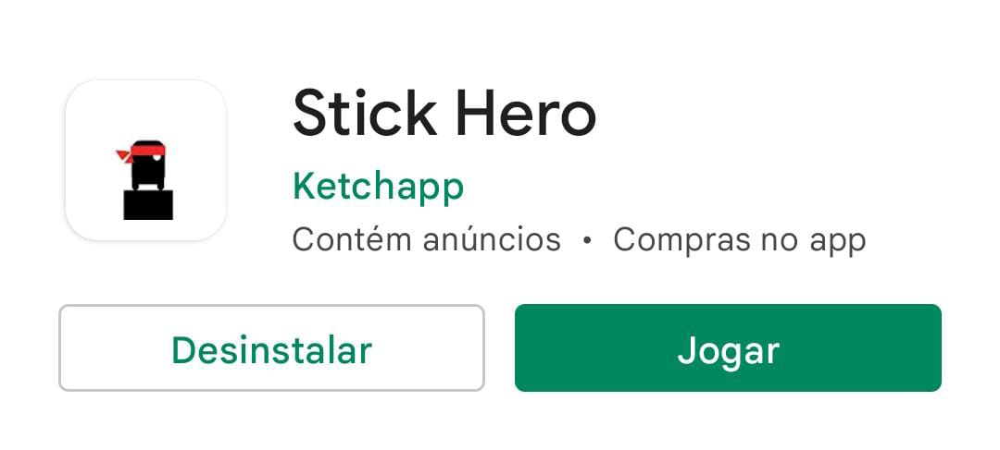

# Automated-Sticker-Hero
A python script to automate the Sticker Hero game

## How to begin
First, you obviously need to install Sticker Hero game, it will be on play store

Then, you'll need to activate your mobile's developer options and enable USB debbugging

Open the game in your mobile device and start it

Connect your cellphone in your desktop and then run the main.py file

